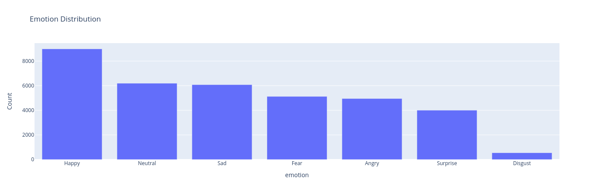
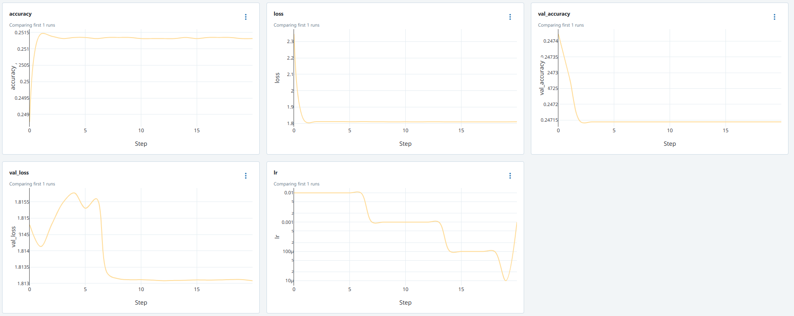
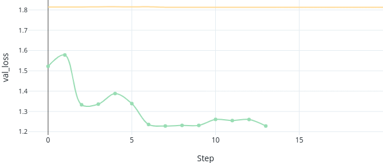
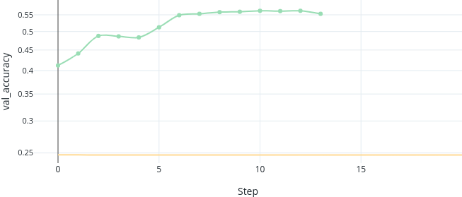
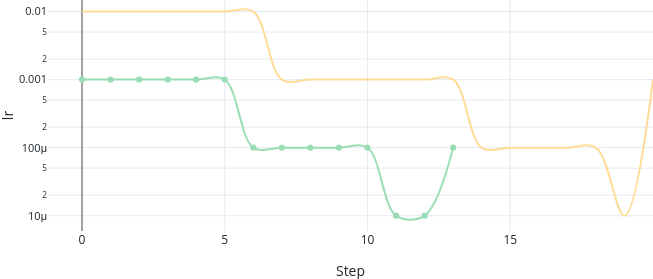
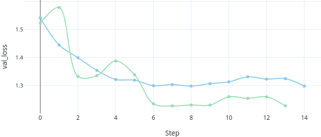
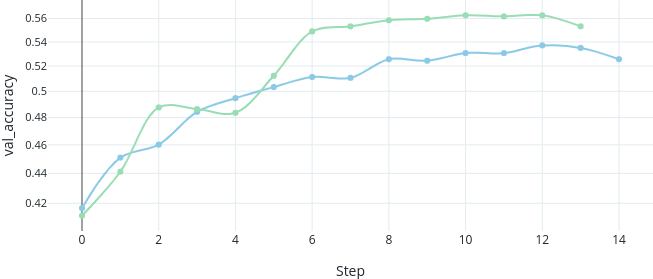
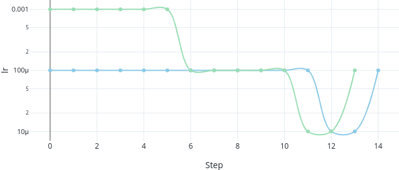
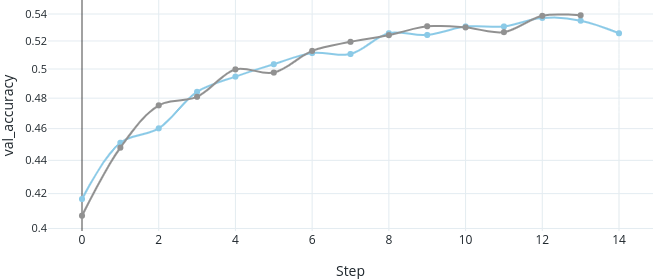

# Facial Emotion Recognition

This repository is my project hand-in for the AKT3 course on Deep Learning & Computer Vision.

## Dataset

For training this model we will be using the [FER2013](https://www.kaggle.com/datasets/msambare/fer2013) dataset.

### Example Data

The dataset contains 48x48 images of human faces.


### Analysis



Using the distribution we can determine a baseline accuracy.

`HappyCounts / TotalCounts = 0.25`

`Baseline accuracy = 25%`

So by always guessing `Happy` we could reach an accuracy of 25%. Our goal is to improve that with the CNN.

## Baseline

Using the `train.py` script we are training a Facial emotion Recognition model that classifies images of human faces on 7 emotions (`"Angry", "Disgust", "Fear", "Happy", "Sad", "Surprise", "Neutral"`).

We split up the dataset into train, validation and test data.

* Train dataset size: 25120 examples
* Validation dataset size: 7179 examples
* Test dataset size: 3588 examples

### Results



As shown in the graphs above we achieve very poor performance with our baseline parameters.

| Parameter                | Value                    |
|--------------------------|--------------------------|
| learning_rate            | 0.01                     |
| loss                     | categorical_crossentropy |
| epochs                   | 50                       |
| batch_size               | 128                      |
| early_stopping_patience  | 7                        |
| lr_patience              | 5                        |
| lr_reduction_factor      | 0.1                      |
| optimizer                | Adam                     |
| num_classes              | 7                        |
| input_shape              | (48, 48, 1)              |
| shuffle                  | True                     |
| restore_best_weights     | True                     |

## Experiment 1 - Improving validation-accuracy

In my first run the model only achieved a validation accuracy of 21% which is very poor. I was confused because other resources showed me that on this dataset significantly higher validation accuracies with similar CNNs could be achieved.

My hypothesis is that I chose a far to high starting learning rate which lead to very early convergence and therefore significant underfitting.
By reducing the learning rate I expect better results.

| Parameter                | Value                 |
|--------------------------|-----------------------|
| learning_rate            | 0.001                 |

### Results 

Validation Loss           |  Validation Accuracy     | Learning Rate
:------------------------:|:------------------------:|:-------------------------:
 |  | 

As we can see in the resulting charts my hypothesis was correct and by reducing the learning rate we achieve much better results.

## Experiment 2 - Smoothing the validation-loss curve

The new validation loss curve is very erratic. I want to make it smoother and reduce the bumpiness of the curve. For this I again will lower the learning rate by a factor of 10.

| Parameter                | Value                 |
|--------------------------|-----------------------|
| learning_rate            | 0.0001                |

### Results

As we can see in the resulting charts my hypothesis was correct and by reducing the learning rate the curve is much less erratic.

Validation Loss           |  Validation Accuracy     | Learning Rate
:------------------------:|:------------------------:|:-------------------------:
 |  | 

## Experiment 3 - Disabling the restore-best-weights option

For some reason in the EarlyStopping callback the restore_best_weights option actually chooses a worse configuration of the model at the end. By disabling the option we want to prohibit that behaviour.

``` python
keras.callbacks.EarlyStopping(
                patience=params["early_stopping_patience"],
                restore_best_weights=False
            ),
```

| Parameter                | Value                 |
|--------------------------|-----------------------|
| restore_best_weights     | False                 |

### Results

In the following graph we see that by disabling the `restore_best_weights` option we can actually keep the better model in the end.



## Testing

I evaluated my best_model on the test dataset and did some experiments.

```python
import tensorflow as tf
from keras.models import load_model
import numpy as np

# Load the saved model from the specified path
model_path = 'output/best_model'
model = load_model(model_path)

train_dataset, val_dataset, test_dataset = load_and_preprocess_data()

# metrics from model.evaluate
val_accuracy = model.evaluate(test_dataset)

print(f"Testing accuracy: {val_accuracy}")

# Get predictions for test data
predictions = model.predict(test_dataset)

# Since 'predictions' is a 2D array, each row corresponds to predictions for a given input
# To get the first prediction, we select the first row
first_prediction = predictions[0]

# Get the class with the highest probability from the first prediction
predicted_class = np.argmax(first_prediction)
print(f"First prediction {first_prediction}")
print(f"Predicted class for the first test example: {predicted_class} = Happy")
```

```txt
Loading dataset...
113/113 [==============================] - 3s 13ms/step - loss: 1.2757 - accuracy: 0.5256 - categorical_accuracy: 0.5256
Testing accuracy: [1.275729775428772, 0.5256410241127014, 0.5256410241127014]
113/113 [==============================] - 3s 13ms/step
First prediction [0.32203916 0.01416158 0.04879333 0.24709927 0.19526306 0.02899002
 0.14365356]
Predicted class for the first test example: 0 = Happy
```
